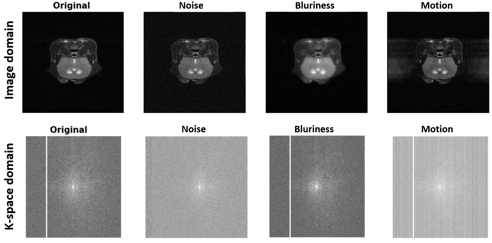

# MRArt

This repository contains MRArt code for the paper: 
> Boudissa, S., Kanli, G., Perlo D. and Keunen O. 2024.
> "ADDRESSING ARTEFACTS IN ANATOMICAL MR IMAGES: A K-SPACE-BASED APPROACH",  ..., ...,... , url (link coming soon).
This paper was accepted to the 21st IEEE  International Symposium on Biomedical Imaging . You can find the poster presented to the  conference under .

## Description
We propose a library named **MRArt**, for MRI Artefacts, that simulates realistic primary artefacts by manipulating the k-space signal, using standard image processing techniques.
MRArt focuses on three degradations commonly encountered in anatomical images:
- Gaussian noise
- Blurriness effect
- Motion artefact

Each of the above degradation are generated with varying levels from low to severe.
The image below illustrates the image domain and the corresponding k-space domain of each degradation types.

{width=40%}

## Getting started
### Requirements

In order to use the library you need to install the following packages:
- pip install matplotlib
- pip install numpy
- pip install pydicom
- pip install scipy
- pip install skimage

You can find instructions on loading the data and utilizing the MRArt library in the Jupyter notebook titled **Examples.ipynb**.

## Support
If you have any questions, feel free to reach out to our support team at imaging@lih.lu.

## Roadmap
We plan to introduce a 3D version of the library in the future, featuring additional degradation types.

## Authors
Selma BOUDISSA, Georgia KANLI, Daniele PERLO, Thomas JAQUET and Olivier KEUNEN.

## Citation 
If you find **MRArt** useful in your research, please use the following for citation.
Boudissa, S., Kanli, G., Perlo D. and Keunen O., "ADDRESSING ARTEFACTS IN ANATOMICAL MR IMAGES: A K-SPACE-BASED APPROACH",2024 (will be completed soon)

